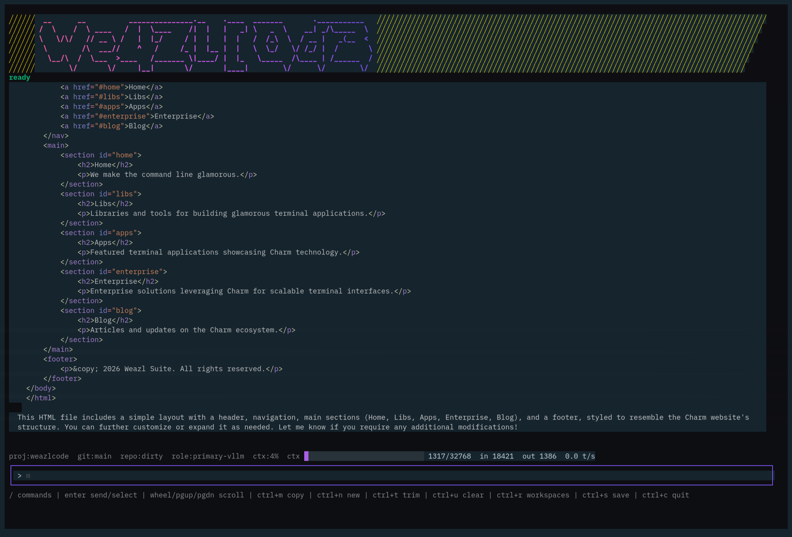

# WeazlCode

The serious one, allegedly. Still a work in progress.

<p align="center">
  
</p>

WeazlCode is a sovereign, local-first AI coding TUI that splits the brain to save the codebase. Big models review the plan; local models do the grindage. Stop letting expensive APIs vomit thousands of lines of messy code into your editor. WeazlCode delivers project-aware terminal sessions, explicit local tools, resumable context, and tightly bounded tasks without turning your workflow into a bloated, black-box agent carnival.

## Current Status: The Split-Brain Loop

WeazlCode has moved beyond simple chat. Phase 1 through 6 of the IDE architecture are implemented, smoke-tested, and live:

- Project-Aware Metal: Git root detection, local `.weazlcode/` state, project summaries, and isolated tool logs.
- The Grindage Loop: Bounded task packets, structured `WorkerPatch` output, unified diffs, path validation, and capped repair loops.
- Split Roles: Orchestrator, worker, reviewer, and summarizer roles with runtime-configured providers.
- Hardened Execution: Separate read-only vs. verification command execution. Bounded-path guardrails keep the worker from wandering outside the sandbox.
- LSP Foundation: Go-first language server support with diagnostics, symbols, and definitions fed directly into task packets.
- Async TUI: Command palettes, diff views, and diagnostics. Async plan/worker/reviewer spinners keep the IDE view alive while long-running models grind in the background.
- Skills Surface: Project and global `SKILL.md` discovery, `/skills` inspection, planner skill selection, and explicit task-level skill attachment.
- Parallel Workers: `workers.concurrency`, task `depends_on`, `/run-workers`, non-overlapping path scheduling, per-task worker cancellation, and configurable worker request timeouts.
- Review Loops: Claude/OpenAI-class reviewers can inspect task-scoped evidence, request focused repairs, and send only bounded repair packets back to the local worker.
- Replan And Cleanup: Rejected or blocked worker outputs are restored to their task baselines, and `/plan replan` can turn completed work, blocked evidence, and remaining tasks into a fresh draft plan.

## Defaults

On first launch, WeazlCode drops a fresh `config.json` into `~/.config/weazlcode/` with sensible local defaults:

- `local-vllm`: `http://localhost:8000`
- model: `local-model`
- `local-ollama`: `http://localhost:11434`
- `workers.concurrency`: `2`
- `workers.request_timeout_seconds`: `300`

Because hardcoding endpoints into a coding tool is how tiny annoyances become permanent roommates, WeazlCode reads your endpoints and models from the config at runtime.

WeazlCode also infers a worker capacity profile from the configured worker model name. A model like `granite-8b`, `llama3.1:8b`, or any other `8b`-style name automatically nudges the planner toward tiny, narrow, 8B-friendly task packets without making you repeat that constraint in every prompt.

## Grab The Source

```sh
go run ./cmd/weazlcode
```

## Install Script

```sh
./scripts/install.sh
```

No wizards. No corporate installers. The script handles the chores: it builds `weazlcode`, tucks it into `~/.weazlcode/bin`, and adds that directory to your shell `PATH`.

During setup, you configure the local worker first, usually Ollama or vLLM. The script queries the provider for available models, then asks for an optional heavyweight LLM provider for planning and review. If you choose `none`, WeazlCode falls back to your local model for planning and will warn you that the orchestration might be a bit raw.

Provider URL rules: bare-metal base URLs only.

- vLLM: `https://host:port` or `https://host`, without `/v1`
- Ollama: `http://host:11434`, without `/api`
- OpenAI-compatible: `https://host`, without `/v1`

If you accidentally paste the `/v1` or `/api` suffixes, the installer quietly sanitizes them for you.

The installer will also ask for a context window preset, from 8192 up to 128000 tokens. Heads up: the XL preset may cause out-of-memory panics on smaller local servers. Finally, you'll set a local history password. Session history and workspace saves are locked in SQLite with a password-protected vault and AES-GCM encrypted payloads.

## Build From Source

WeazlCode is pure Go, but it uses SQLite through `go-sqlite3`. Builds require Go 1.25 or newer, CGO, and a working C compiler. It's built for solid, reliable standards-based systems like Ubuntu LTS. That C compiler requirement is the one little bit of yak hair you have to shave.

### macOS

```sh
xcode-select --install
go build -o weazlcode ./cmd/weazlcode
```

### Windows With MSYS2

Install Go for Windows, then use MSYS2 to install a C compiler.

```sh
pacman -S --needed mingw-w64-ucrt-x86_64-gcc
```

Then build:

```powershell
go build -o weazlcode.exe ./cmd/weazlcode
```

Initialize project instructions from your repo root to drop the primary `WEAZLCODE.md` instruction file:

```sh
weazlcode init
```

## The Command Deck

Slash commands drive the IDE. Hit `/` to open the palette.

- Workflow: `/plan draft`, `/plan generate`, `/plan replan`, `/run-task`, `/run-worker`, `/run-workers`, `/run-reviewer`, `/commit-message`, `/export-run`.
- Views: `/diff`, `/outputs`, `/files`, `/preview`, `/skills`, `/diagnostics`, `/symbols`.
- Control: `ctrl+t` trims context, `ctrl+u` nukes active session context, `ctrl+s` saves workspace, and `ctrl+r` / `ctrl+w` opens the workspace picker.
- Mouse/Copy: `ctrl+m` toggles between terminal copy mode and TUI mouse-scroll mode.

## Context Trimming & Token Burn Defense

The status line gives you the vitals on your local inference: estimated context usage, token counts, and generation speed (`t/s`).

Running out of room? Press `ctrl+t`. WeazlCode commands the active model to summarize the current conversation into a compact checkpoint. Future requests send that tight summary plus only the new messages, saving your hardware from replaying the entire session from the top.

If you forget to trim, WeazlCode steps in with opinionated working-context thresholds. Small windows run close to the edge; large windows compact much earlier so your 128k context stays as useful headroom instead of degrading into a giant prompt tax.

## Review, Repair, Replan

The happy path is simple: the orchestrator creates small tasks, local workers write patches, and the reviewer approves the task-scoped diff. When the worker gets it wrong, WeazlCode keeps the blast radius tight:

- Reviewer `needs_fix` verdicts restore the task's allowed paths to the captured baseline before sending a focused repair packet back to the worker.
- Worker blockers and reviewer-blocked tasks also restore their allowed paths, so rejected files do not linger as half-truths in your repo.
- Every cleanup is recorded as an `output_cleanup` task event.
- `/plan replan [guidance]` asks the orchestrator to build a fresh draft plan from completed tasks, blocked-task evidence, and still-pending work.

That is the split-brain bargain: local models can try, fail, and retry cheaply, while the frontier model spends tokens on judgment and plan correction instead of writing every line itself.

## TUI Feedback

While the models grind, WeazlCode uses Bubble spinner animations with rotating status phrases like `hacking_the_gibson`, `wheezing_the_juice`, and `chilling_the_tokens` to keep the screen alive.

Tool calls stay neatly tucked away as `using tools` in the transcript. WeazlCode keeps the raw JSON bookkeeping in the encrypted history so the model maintains state, but hides the ugly scaffolding from your view. Assistant responses are rendered cleanly with Glamour-powered Markdown once they land.

## Tool Execution

WeazlCode is not a static chat window. It supports native function calling to interact with your local workspace. Important: you need a model with native tool support, such as Llama 3.1 or Mistral-Nemo, for the fun stuff.

Configure tools in `~/.config/weazlcode/config.json`:

- Workspace Tools: Operates strictly under configured `workspace_roots`. Includes `read_file`, `git_diff`, `apply_patch`, and local SQLite querying.
- Execution Tools: `run_readonly_command` executes a tight allowlist of inspection commands like `rg`, `cat`, and `ls`. `run_verification_command` runs approved linters/tests and requires explicit prompt-level approval.
- Memory: Encrypted local memory storage with remember/recall support.

## Security

We take data sovereignty seriously, but this is a TUI app, not a hardware security boundary. The bcrypt checks and AES-GCM payloads exist to lock out casual snooping. They are not a guarantee that a weak password will survive a dedicated offline attack against your database.

- Safe tools are strictly read-only or create-only.
- `create_file` will flat-out refuse to overwrite existing files.
- Shell commands are allowlisted and pass safely as args, never as raw shell strings.
- Tool execution happens locally inside the WeazlCode process. API keys live in your config and never leave your machine.

## License And Branding

WeazlCode is released under the MIT License. Fork it, learn from it, ship it.

The WeazlCode name, screenshot, and cyborg-ferret branding are part of this project's identity. If you publish a heavily modified fork, strip the branding and rename it so users know who is actually maintaining the code.
